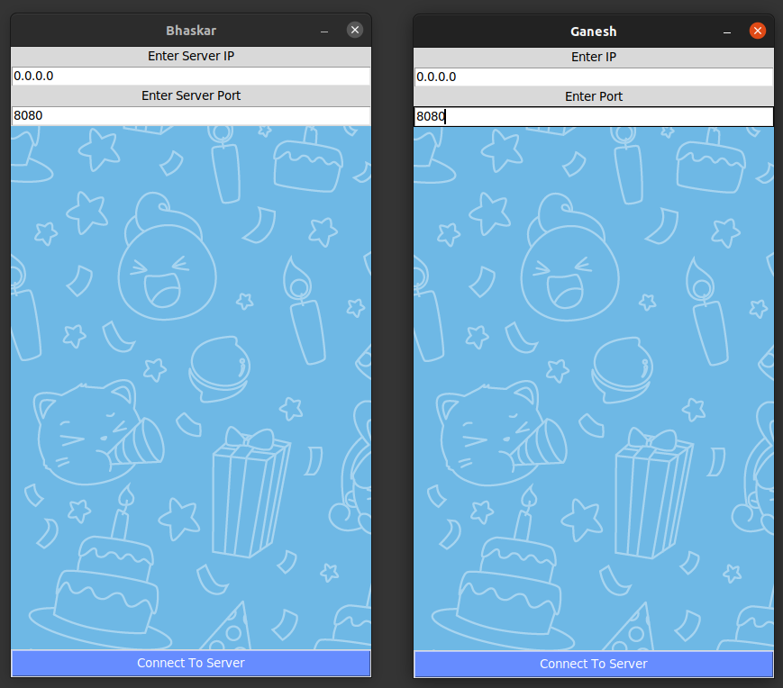
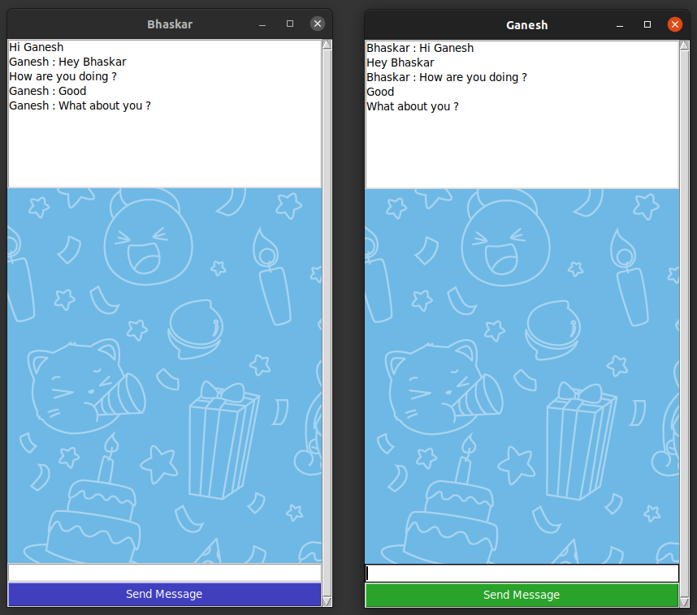

# EncrypTalk

EncrypTalk is a server-client chat application with a graphical user interface (GUI) implemented in Python using sockets. It provides end-to-end encryption for all messages using the RSA algorithm.

## Features

- Server-client architecture for real-time chat communication.
- Graphical user interface (GUI) for an intuitive user experience.
- End-to-end encryption of messages using the RSA algorithm.
- Secure generation and exchange of public and private keys.

## Installation

1. Clone the repository

2. Install the required dependencies: ```pip install rsa tkinter```
3. Run the server code on one machine and the client code on another machine or within separate terminals.

4. Follow the on-screen prompts to set the server IP and port, connect to the server, and start the chat.

## Usage

1. Launch the application by running the client code.

2. Enter your name to identify yourself in the chat.

3. Specify the server IP and port to connect to the server.

4. Once connected, you can send and receive encrypted messages within the chat window.

5. To send a message, type your text in the input field and click the "Send Message" button.

6. The received messages will be displayed in the chat history.

## Output
### Establishing the Connection


This screenshot shows the initial step of establishing the connection in EncrypTalk. Users need to enter the server's IP address and port number to connect to the server and initiate the chat session.

### Chat Window


This screenshot illustrates the chat window of EncrypTalk. Users can enter messages in the input field at the bottom and send them by clicking the "Send Message" button. The chat history is displayed above the input field, showing both sent and received messages.

## Security

EncrypTalk uses the RSA algorithm for secure communication. It generates a pair of public and private keys for each user, ensuring that only the intended recipient can decrypt the messages.

## Contribution

Contributions to EncrypTalk are welcome! If you find any issues or have suggestions for improvements, please feel free to submit a pull request.

## License

This project is licensed under the [MIT License](LICENSE).
